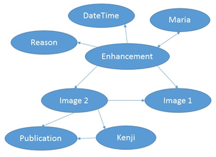

# Goal

Keep track of a digital object and any processing that has been
performed upon it. The processors should be able to get credit for
adding value to the digital object.

# Summary

Kenji is an academic oceanographer who is publishing a paper about
primary productivity in the open ocean. He performed analyses on
several publicly-available satellite images in order to improve
resolution so he could use them in his paper. The improved images were
then resubmitted back to the original repository. Maria, the data
manager at this repository (of satellite images) notices that these
two images are related to each other and wants other users to easily
find this out and know that Kenji did the work. She wants to link the
images in her repository and add metadata describing who did what to
the original image that resulted in the improved image.

## Alternative:

Researcher A records a large volume of video with an automated*
underwater vehicle. The main focus of current research is to determine
the abundance of a specific species of pelagic fish that has economic
value to the community. To achieve this, the researcher develops
automated methods for frame-based image recognition and publishes a
paper on the relative abundance of the species.

Some time later, researcher B hypothesizes that certain pelagic fish
species alter their schooling behaviour based on proximity of predator
species, and analyses the same video sample collection with motion
tracking and species recognition software. The only link between the
two sets of research in formal terms will be a shared sampling event
(digital sample) identifier.

# Actors

-   Kenji, oceanographer
-   Maria, data manager
-   Researcher A: species abundance expert
-   Researcher B: species interaction expert

# Preconditions

- There already exists a system that contains a digital object
- The data manager logs in and finds the object and metadata of
  interest.
- Kenji already has an ORCID
- A system of persistent, unique, dereferenceable IDs for digital
  objects is in place, like DOI
- The repository system is capable of generating citable references
  for users to copy into their publications for each digital object.
- A publicly available resolver exists for citations of digital
  samples/sampling events.

# Post Conditions

- A citation is available for users that gives credit to Kenji for the
  analysis and the repository for stewardship, and enables the
  unambiguous identification of the image in question by a third party
- A citation is available that credits researcher A with the sample
  and its curation.

# Triggers

- Maria notices the two related images that are not formally connected
  in her repository
- She finds the splash page for the derived image
- Maria clicks on a button that says “Make Connection”.
- Researcher A needs a citation index on samples and sampling events
  to demonstrate the value of their sampling programme and automated
  equipment to funders.

# Normal Flow

1. A pop up window appears with the ID and a thumbnail of the derived
   image on the left. Moving right there is an arrow pointing to the
   right and then a text box with two buttons underneath, “Connect”
   and “Cancel”
2. Maria begins typing the ID of the original image in the text box
   and it is autofilled
3. Maria clicks “Connect”
4. The ID and a thumbnail of the original image appears on the
   right. A drop down list appears underneath the arrow.
5. From this dropdown list, Maria chooses the relationship
   “DerivedFrom”
6. Two buttons appear, “OK” and “Cancel”
7. Maria clicks “OK”
8. The first popup disappears and a second appears asking for metadata about the relationship she just added
9. The exact configuration of the metadata window depends on the
   relationship chosen previously. For DerivedFrom, the system asks
   for an actor(s), which is added via ORCID, the action from a
   controlled vocabulary, and a reference which in this case would be
   the doi of Kenji’s paper. The system would autoload the date and
   time of the upload of the derived image, but would allow Maria to
   edit.
10. There are two buttons at the bottom “OK” and “Cancel”. Maria
    clicks “OK”
11. She is presented with a pop up review screen and clicks “Confirm”
    (there is also an “Edit” button)
12. The system automatically adds that Maria is the one who created
    the “DerivedFrom” relationship on that day.

##  Alternative:

1. A globally available digital sample/ sample event registry and
   resolver service is available. The registry supports basic
   services:
    a. Register a digital sample or sampling event by way of a
       universal metadata record describing the event. This act of
       registration creates a sample PID (SID).
    b. Synchronise SIDs with domain-specific registries (for example
       GBIF - GBIF does not register digital samples/ events at
       present, as far as I am aware, but does this for physical
       specimens)
    c. Resolve a reference to a SID by linking the institutional
       metadata record for the sample, and to the digital object
       itself.
2. The service mines “citations and mentions” of the SIDs in journal
   articles and data publication registries (e.g. DataCite) and builds
   a SID citation index.
3. The service links, where possible, ORCIDs and DOIs to SIDs and
   de-duplicates the links.

# Alternate Flows

- Maria can click “Cancel” in any of the windows and the pop up
  disappears.
- Clicking “Edit” in the final review screen will take the user to a
  single popup where everything is editable with an “OK” and a
  “Cancel” button. If the user hits “OK” the review screen reappears
  with the changes. If the user hits “Cancel” the pop up disappears
  and no changes are made.

# Exception Flows

- If any of the boxes are left blank, when the user clicks “OK”, the
  system should remind the user that all information is required and
  then take he/she back to the editing window.

# Entities

- Person doing the action - In this case Maria
- Action 1 - In this case connecting two related digital images
- Objects that receive the action - In this case the digital images.
- Person that performed an action on one of the images - In this case Kenji
- Action 2 - In this case the modification of one image into another by Kenji
- Publication - In this case the paper Kenji published using the derived image

## Alternative

- Digital Sample/Sampling Event
- Researcher A, took the video collection and analyzed it
- Researcher B, analyzed the same collection later for a different purpose
- Equipment - In this case the vehicle and the video equipment
- Publication
- Video and Video Collection

# Properties

- DerivedFrom
- Authored hasAuthor
- PerformedBy Performed

# Diagram

  

# Notes

Note: It may be possible to

- Extend the DataCite metadata schema to account for samples and
  sampling events
- Convince DataCite to allow registration of samples and sample events
  as pseudo-data objects. I do not see any reason why this will not be
  possible.

## DataCite Mapping

  ------------------------------------------------------------------------------------------------------------------------------------------------------------------------------------------------------------------------------------------
  **Metadata Element**   **Cardinality**   **Mandatory**     **Purpose**       **Notes**
  ---------------------- ----------------- ----------------- ----------------- -------------------------------------------------------------------------------------------------------------------------------------------------------------
  Identifier             1                 Yes               Citation          DOI

  AlternateIdentifier    0-1               Yes               Re-Usability      Do you have an identifier for the object?

  Title                  1                 Yes               Citation          Title

  Creator                1-n               Yes               Citation          Type is ‘Author’ by default, and can be an institution instead of an individual. Maybe use institution here by convention for samples
                                                                               
  -   Affiliation                                                              
                                                                               
  -   Identifier                                                               
                                                                               
                                                                               

  Publisher              1                 Yes               Citation          

  PublicationYear        1                 Yes               Citation          

  Contributor            0-n               No                Citation          Type=
                                                                               
  -   Affiliation                                                              DataCollector
                                                                               
  -   Identifier                                                               DataCurator
                                                                               
                                                                               HostingInstitution
                                                                               
                                                                               ...

  Subject                0-n               No                Discoverability   Scheme and Authority can be used to accommodate discipline-specific vocabularies for sample types, event types, protocol types, instrument types, etc.
                                                                               
  -   Scheme                                                 Coverage          
                                                                               
  -   Authority                                                                
                                                                               
                                                                               

  Date                   0-n               Yes for Samples   Discoverability   Date of sampling event is critically important
                                                                               
  -   Type                                                   Coverage          Date types=
                                                                               
                                                                               

  GeoLocation            0-n               Yes for Samples   Discoverability   Type=
                                                                               
  -   Type                                                   Coverage          Box
                                                                               
                                                                               Point
                                                                               
                                                                               *May need extension to account for polygons, lines or polylines (transects or voyages), 3D volumes.*

  ResourceType           0-n               Yes for Samples   Discoverability   Open, but can also be a type.
                                                                               
  -   Type                                                                     Applicable Types for (Digital) Samples=
                                                                               
                                                                               Audiovisual
                                                                               
                                                                               Collection
                                                                               
                                                                               Event
                                                                               
                                                                               Image
                                                                               
                                                                               PhysicalObject
                                                                               
                                                                               Sound

  Description            0-n               Recommended       Reusability       Types=
                                                                               
  -   Type                                                                     Abstract
                                                                               
                                                                               Methods
                                                                               
                                                                               SeriesInformation
                                                                               
                                                                               TableOfContents
                                                                               
                                                                               Other

  RelatedIdentifier      0-n               Recommended       Reusability       Use to link to other registries. Supports the following and should be extended for existing and future physical sample registries such as GBIF, iSamples, …
                                                                               
  -   Type                                                                     ARK arXiv bibcode DOI EAN13 EISSN Handle ISBN ISSN ISTC LISSN LSID PMID PURL UPC URL URN
                                                                               
                                                                               
  ------------------------------------------------------------------------------------------------------------------------------------------------------------------------------------------------------------------------------------------
