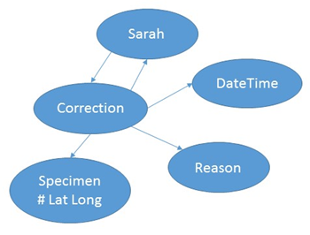

# Goal

To continue to improve the metadata of an object (physical or digital)
after the initial collecting event or digitization event. The person
who improved the metadata and how and when the improvement was made
should be recorded. Any user should be able to find this information
and use it to assess the actor.

# Summary

Sarah is a metadata curator at a museum. She has found a mineral
specimen that has the latitude and longitude inverted on the specimen
card. She wants to fix this error in the electronic system the museum
uses for managing specimens. Her department gets funding based on how
much work they do, so the system needs to record who did the
correction, when, and why.

Michael is a scientist accessing specimen at the museum. He discovers
an error in the metadata for an item and wants to report it back to
the museum. Part of his evaluation of the error is his expertise in
the field/domain. Once the record is amended, it is important to
capture when the change was made. If someone else previously published
findings on this specimen the record needs to reflect that a change
happened after the publication. Michael reports the error to the
curator (Sarah) for correction.

# Actors

- Metadata Curator, Sarah
- Scientists, Michael

# Preconditions

- There already exists a system that contains a digital object (could be a digital representation of a physical object)
- The metadata curator logs in and finds the object and metadata of interest.
- Sarah has an ORCID
- A system of specimen identifiers is in place, such as IGSN

# Post Conditions

- Behind the scenes, the system records the correction, the
  reason/evidence for the correction, the identity of the curator, and
  the date/time of the correction. The previous incorrect data are
  also kept, but deprecated.

- Sarah is returned to the splash page for the digital object she was
  curating. There is a visual evidence that the change was made.

- Outsiders viewing the record should be able to see that changes have
  been made and when they were made.

# Triggers

The user locates incorrect data and clicks “edit” to make the correction

# Normal Flow

 1. Sarah is presented with an editable version of the the incorrect data.
 2. She makes the correction. Hits “ok”.
 3. The editable version of the data disappears
 4. She is prompted for the reason for the correction and any related evidence (possibly a controlled vocabulary)
 5. She adds the reason for the correction. Hits “ok”

# Alternate Flows

- Every “ok” or “edit” button should also be accompanied by a “cancel”
  button that takes the user back to the previous page (likely the
  digital object splash page).

# Exception Flows

- If no evidence or reasoning is given for the change, the system
  should remind the user that this information is required and give
  another chance to add the information.

# Entities

- Person (Curator) - In this case, Sarah
- Action - In this case correcting inverted numbers
- Thing that was acted upon - In this case a latitude/longitude pair
- Reason for the action - In this case whatever gave Sarah the idea that the lat long was inverted.
- DateTime of the Action
- Notes - any important notes?

# Properties

PerformedBy and Performed

# Diagram

# Notes

The information should be changed by the curator, but there should
also be a mechanism for reporting error by the end user to the curator
or manager of the system. This is different than evaluating quality.

